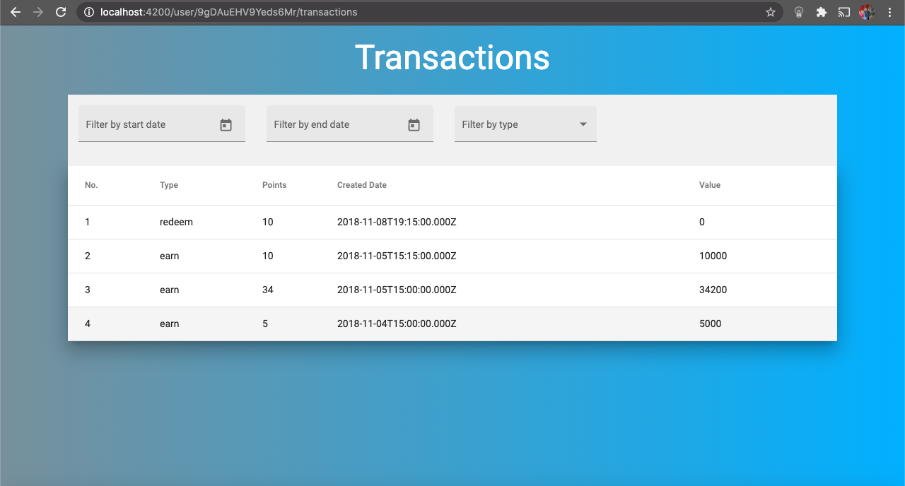
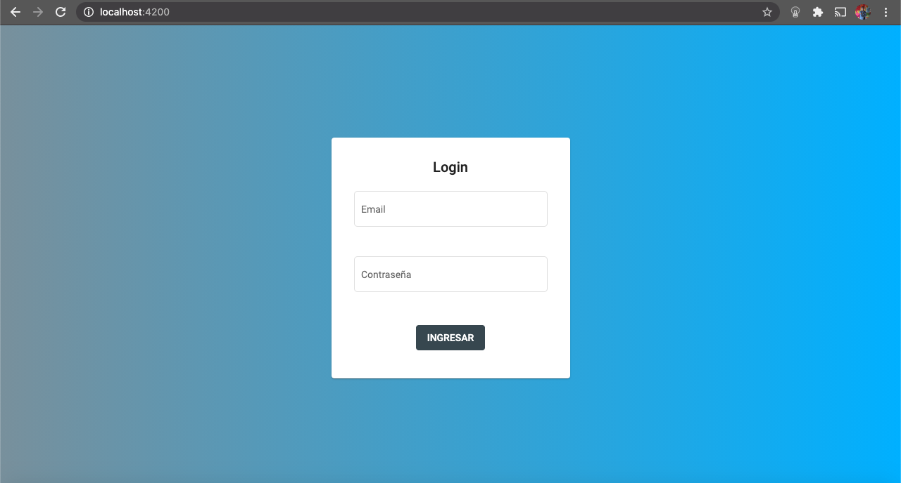

# Descripción general

Este es un proyecto desarrollado como prueba para la empresa Leal que se desarrolló utilizando el framework Angular con elementos gráficos de Material Design. Consiste básicamente en una plataforma web que permite el inicio de sesión y que le muestra al usuario el listado de trasnacciones realizadas, el cual se puede filtrar por rango de fechas y por tipo, y también permite ver el detalle de cada transacción.

# Componentes

El proyecto consta de un módulo para la autenticación, por medio del cual se llama el servicio de login y se obtiene el token de acceso. Este valor se guarda en el local storage para que el módulo de transacciones lo utilice y pueda llamar el servicio que obtiene el histórico de transacciones del cliente. Para estos llamados al API se creó un módulo denóminado HttpClient en el cual se centralizan los métodos REST que invocan los web services.

# Vista previa

Se presentan a continuación algunos pantallazos que muestran la parte gráfica de la aplicación:

# Instrucciones

Para poder correr este proyecto en un navegador local es necesario seguir los siguientes pasos:

* Clonar el proyecto
* Generar las dependencias corriendo el comando npm install sobre la raíz del proyecto
* Ejecutar el comando ng serve que despliega la aplicación 
* Abrir el navegador en localhost:4200

# Comentarios

Las funcionalidades de filtrado por fecha y por tipo se realizaron desde el front y no por medio del API porque al cambiarle las fechas no cambiaba el resultado y porque no había manera de filtrar por tipo usando web services.